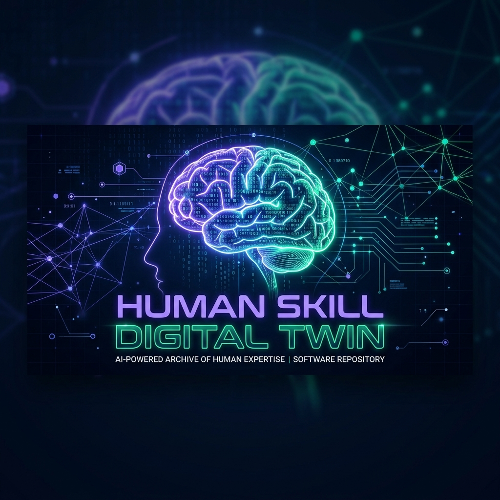
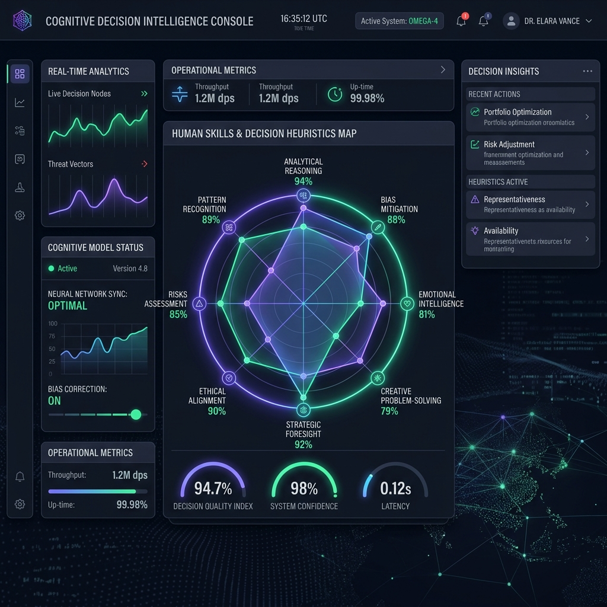

# Human Skill Digital Twin 🧠

<p align="center">
  
</p>

A production-ready, enterprise-grade, fully open-source AI platform designed to model a person's cognitive evolution, memory intervals, learning style preferences, and decision metrics.

**This is NOT a learning management system. This is NOT a note-taking application. This is NOT an AI chatbot.**

It models how a person learns, forgets, practices, and makes decisions, utilizing local data pipelines to predict learning velocities and career readiness.

---

## Key Features

1. **Digital Twin Core Engine**: Models parameters including learning style DNA, overall memory retention, active skills proficiency levels, and streak metrics.
2. **Knowledge Graph Engine**: Interconnected concept mapping using NetworkX to identify prerequisite gaps.
3. **Memory Intelligence Engine**: Modified SM-2 spaced repetition decay forecasting schedules.
4. **Decision Intelligence**: Track architectural decisions, audit speed indices, and expose cognitive heuristic bias (e.g. overconfidence bias).
5. **Learning Simulator**: Sliders to run 12-month projections of mastery, decay, and burnout.
6. **Explainable AI**: Injects clear, mathematical reasoning and evidence summaries for every recommendation.
7. **Offline First**: Relational SQLite, in-memory NetworkX caching, local FAISS vectors, and local Ollama integrations.

<p align="center">
  
</p>

---

## Technology Stack

- **Backend**: Python, FastAPI, SQLAlchemy, NetworkX, NumPy, scikit-learn
- **Frontend**: React, TypeScript, Vite, Tailwind CSS, Lucide React
- **Databases**: SQLite (Default / fallback), Postgresql & Neo4j (Supported)

---

## Quick Start (Windows)

1. **Install Prerequisites**: Python 3.10+ (Add to PATH) & Node.js 18+ (LTS).
2. **Run Installer**:
   ```cmd
   scripts\setup.bat
   ```
   This script builds virtual environments, pip requirements, and npm modules.
3. **Launch Platform**:
   ```cmd
   scripts\run.bat
   ```
   This command starts the FastAPI server (Port 8000) and the Vite web client (Port 5173) in separate consoles.
4. **Log In**: Open `http://localhost:5173` and log in with the seeded credentials:
   - **Email**: `demo@digitaltwin.ai`
   - **Password**: `password123`

---

## Documentation

For deep dives, check out the resources inside the `docs/` folder:
- [Architecture & Formulas](docs/architecture.md)
- [Installation Guide](docs/installation.md)
- [Plugin SDK Guide](docs/plugin_sdk.md)
