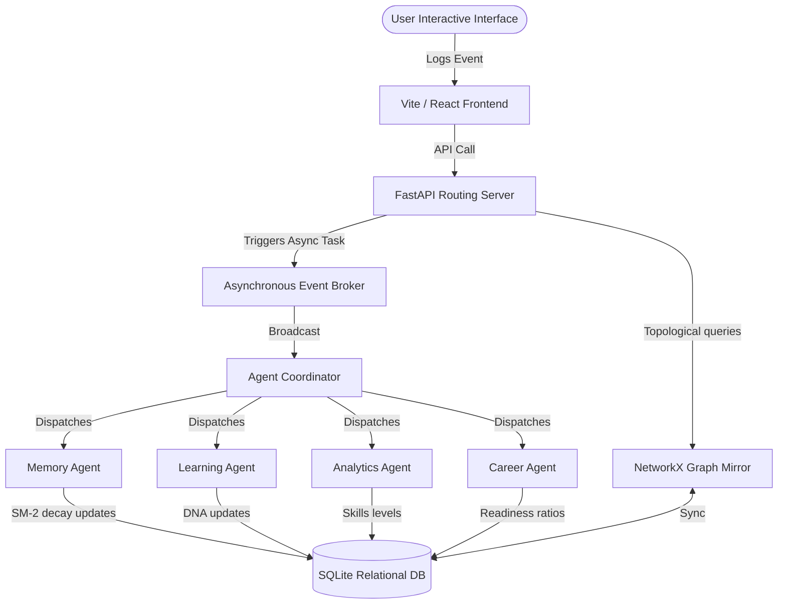

# Human Skill Digital Twin - Architecture Guide

This guide details the architectural choices, cognitive engines, event structures, and schemas powering the platform.

---

## 1. Directory Architecture

The platform follows a clean separation of layout concerns:
- **`app/core/`**: Security credentials validation, JWT signing, DB connections and settings, and asynchronous event bus.
- **`app/models/`**: Table definitions for Users, Twin states, Knowledge concept nodes, Logs, Decisions ledger, and Reflections logs.
- **`app/engines/`**: The core logical modules containing the formulas and cognitive metrics analysis (spaced interval reviews, weakness diagnostics, trajectories simulation, prompt builder contexts, career alignment formulas).
- **`app/agents/`**: Decoupled callback workers subscribing to events triggered by user sessions.
- **`app/api/`**: Routers handling inputs and formatting outputs.
- **`app/sdk/`**: Plugins registry interfaces.

---

## 2. In-Memory Graph and SQLite Mirroring

Knowledge Graphs are represented as directed acyclic dependency models where concepts are nodes and prerequisites are edges.
- For efficient calculations (like topological paths, predecessors search, spring layout generation), we query SQLAlchemy items and construct a **NetworkX DiGraph** in memory.
- Coordinates for layouts are automatically calculated based on prerequisite depths to prevent overlapping overlaps in visual charts.

---

## 3. Cognitive Formulations

### 3.1 Memory Decay & Spaced Repetition (SM-2 Modification)
For each concept interaction scoring quality grade $q \in [0, 5]$, the engine updates repetition intervals:
$$\text{Interval}(r) = \begin{cases} 
1 & \text{if } r = 0 \\ 
6 & \text{if } r = 1 \\ 
\text{Interval}(r-1) \times EF & \text{if } r > 1 
\end{cases}$$
$$EF_{\text{new}} = EF_{\text{old}} + \left(0.1 - (5 - q) \times \left(0.08 + (5 - q) \times 0.02\right)\right)$$
Memory retention probability $R$ decays exponentially over $t$ days since last review:
$$R = e^{-\frac{t}{S}} \quad \text{where } S = EF \times (r + 0.5)$$

### 3.2 Learning DNA suitability
Engagement metrics shift style weights proportionally using exponential smoothing:
$$\text{StyleScore}_{\text{new}} = \text{StyleScore}_{\text{old}} + 0.05 \times \text{DurationWeight}$$

---

## 4. Decoupled Event-Driven Bus

The event bus (`app/core/events.py`) manages concurrent asynchronous loops:
1. Core routers save user logs to SQLite.
2. Routers call `event_broker.publish(event_type, payload)` inside an async context.
3. The broker runs non-blocking `asyncio.create_task` instances for all matching listeners.
4. Agents run independent updates and commit results back to SQLite, triggering downstream career benchmarks calculations.
